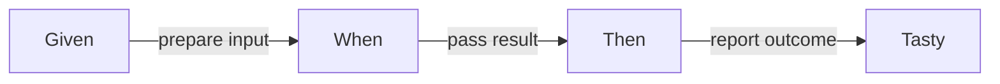

# tasty-bdd

Typed Given/When/Then scenarios for Haskell's Tasty test framework.

## User stories: write readable test scenarios

As a test author, you can express setup, an action and assertions using constructors or `do` notation. Successful assertions pass the Tasty test; failed equality assertions show structural differences.



```haskell
import Test.BDD.LanguageFree (given, then_, when_)
import Test.Tasty (defaultMain)
import Test.Tasty.Bdd ((@?=), testBehaviorF)

main :: IO ()
main = defaultMain $ testBehaviorF id "addition" $ do
    initial <- given $ pure (40 :: Int)
    when_ (pure $ initial + 2) $ then_ (@?= 42)
```

This example is compiled and run by the `example` test suite. See [scenario examples](docs/stories/scenarios.md) and the [execution model](docs/architecture/execution.md) for setup, teardown and fail-fast behavior.

## Build and contribute

```sh
nix develop --accept-flake-config
just build
just unit
just ci
```

The locked flake uses GHC 9.12.3 on x86_64 Linux. `nix flake check --accept-flake-config` runs the packaged build, tests, lint, formatting and documentation checks. Other systems have not been verified. See [development](docs/development.md) and the [Spec Kit plan](specs/001-modernization/plan.md).

## Published package

[Hackage](https://hackage.haskell.org/package/tasty-bdd) carries 0.1.0.0 and 0.1.0.1. GitLab history through January 2025 is retained here, including the source published in 0.1.0.1. This modernization has not published a new package. See [release preparation](docs/releases.md).

Licensed under [BSD-3-Clause](LICENSE).
