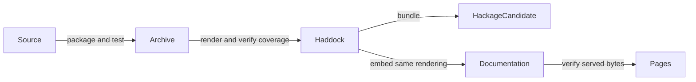

# API reference

## Find the types and functions for your scenario

As a test author, you can browse the exact API rendering built for the current Hackage release candidate. Choose a module below, or use the symbol index inside the reference.

- <a href="../haddock/Test-Tasty-Bdd.html" target="bdd-api">Tasty integration and decorators</a>
- <a href="../haddock/Test-BDD-Language.html" target="bdd-api">Typed constructor DSL and lenses</a>
- <a href="../haddock/Test-BDD-LanguageFree.html" target="bdd-api">Free-monad DSL and interpretation</a>
- <a href="../haddock/System-CaptureStdout.html" target="bdd-api">Standard-output capture</a>

<iframe name="bdd-api" title="Current tasty-bdd Haddock API reference" src="../haddock/Test-Tasty-Bdd.html" style="width: 100%; height: 75vh; border: 1px solid #888; border-radius: 4px;"></iframe>

[Open the API reference in a full page](haddock/index.html).

## Keep reference and release together

The documentation build extracts the checked Hackage Haddock bundle. CI rejects missing or stale embedded files; hosting links and missing generated instance-anchor targets are adapted for GitHub Pages. Available dependency links lead to Hackage. The package’s own types, functions and source remain browsable here.

