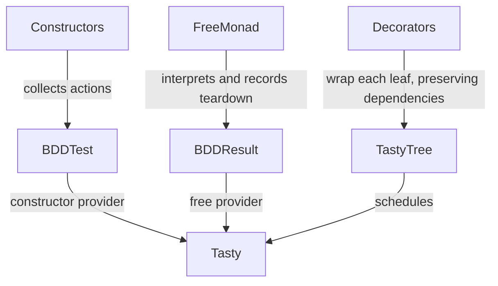

# Scenario execution

## Understand how your scenario runs

As a test author, you need to know which actions execute and where failures are reported before choosing a scenario interface.

`Test.BDD.Language` constrains preparation and testing phases with types. Its interpreter collects actions without executing them. `Test.BDD.LanguageFree` provides the `do` interface and returns a result with recorded teardown. `Test.Tasty.Bdd` adapts both forms to Tasty.

Recursive `beforeEach` and `afterEach` decorators descend through groups, resources, options and Tasty `After` dependency wrappers. They preserve the dependency wrapper while decorating its children.

## Design choices

| Choice | Alternative | Reason |
|---|---|---|
| Keep both public interfaces | Replace one with the other | Existing users depend on their distinct API and teardown behavior. |
| Preserve released dependency traversal | Start from GitHub's older code alone | GitLab and Hackage already include the compatibility fix. |
| Compile the documentation example | Show an unchecked snippet | Readers receive an example exercised by CI. |
| Keep runtime semantics stable | Redesign resource safety in this update | Tooling modernization is not a resource-management API change. |

`captureStdout` redirects process-wide standard output and suppresses action exceptions. It is intended for controlled test execution; concurrent capture is not isolated. The test harness runs serially by default.
