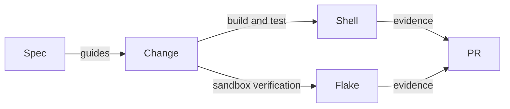

# Develop tasty-bdd

## Make a change and verify it

As a contributor, you use the same locked tools and executed checks locally and in CI.

```sh
nix develop --accept-flake-config
just build
just unit
just format
just ci
```

`just build` and `just unit` use `-O0`; packaged Nix builds use `-O2`. CI enables the manual `werror` flag. Published consumers do not inherit `-Werror` by default. `cabal.project` pins the package index and enables all test suites.



The flake's `unit`, `format-check`, `hlint`, `cabal-check`, `workflow-check`, `api-compat`, `hackage-quality` and `docs` apps provide focused checks. `api-compat` loads all four modules from the hash-pinned Hackage 0.1.0.1 source and this checkout under the same GHC, then compares their exported types, constructors, roles and signatures, including `onEach`. The runtime suite separately checks traversal through resources, options, groups and dependencies. This is a source-API check on the locked compiler, not a binary-ABI or full dependency-range guarantee. `nix build .#docs` produces the strict MkDocs site. No Hackage credentials are needed.

## Specify a change

Read `.specify/memory/constitution.md` first. The `.specify/scripts/bash` helpers and `.specify/templates` support numbered features under `specs/`. The modernization is recorded in `specs/001-modernization`. Use `SPECIFY_FEATURE=001-modernization` with helpers when working on the named maintenance branch. Keep spec, plan and task status consistent with evidence.

Spec Kit's agent prompts are installed globally rather than duplicated in this repository. The bundled scripts/templates come from Spec Kit 0.4.2; direct initialization avoided an upstream release-packaging SIGPIPE failure.

CI uses GitHub-hosted runners while the repository belongs to `paolino` and the organization `nixos` runner after transfer to `lambdasistemi`. Runner access and cache credentials must be rechecked after transfer.

## Read the deployed documentation

[GitHub Pages](https://lambdasistemi.github.io/tasty-bdd/) hosts the MkDocs site. Deployment checks the served revision and compares every generated HTML page and the Mermaid renderer with the build. During modernization, the named maintenance branch may deploy before merge; normal deployments follow `master`.
