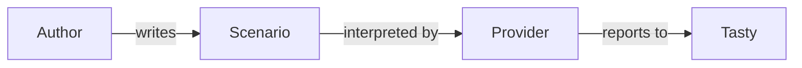

# tasty-bdd

## Write scenarios your team can read

As a Haskell test author, you describe preconditions, perform an action and check its result. Tasty runs each scenario and reports success or a structural equality difference.

Start with [writing a scenario](stories/scenarios.md). The [execution model](architecture/execution.md) explains ordering and teardown; [development](development.md) describes reproducible builds and contribution checks.

The public interfaces remain `Test.BDD.Language`, `Test.BDD.LanguageFree`, `Test.Tasty.Bdd` and `System.CaptureStdout`. The constructor spelling `Succeded` remains part of the published API.
