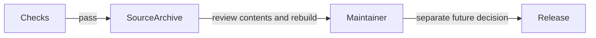

# Prepare a release

## Review a package before publication

As a maintainer, you need a checked source distribution and a deliberate version choice before publishing a package used by others.

Run `nix develop --accept-flake-config -c just release-check` to create checked source and Hackage-mode Haddock archives plus `SHA256SUMS` in `result-release`. The prepared candidate is version 0.1.0.2. The `hackage-quality` gate unpacks the source archive, runs `cabal check`, builds and tests with the consumer warning policy, and requires 100% Haddock coverage for every module with no unresolved local references. It runs offline against the locked dependency environment and is required by CI. The source archive and Haddock bundle are review artifacts; preparing them does not publish a package.

Repository ownership does not change Hackage ownership or existing package descriptions. Hackage 0.1.0.1 currently points to GitLab. A GitHub transfer alone will not update those links. Existing Hackage tarballs remain historical artifacts.

The release workflow prepares an archive for review and never uploads to Hackage. No automatic tagging or package publication is enabled by this modernization.

External dependency links in the optional Haddock bundle depend on installed dependency interfaces; missing external interfaces do not waive the package’s own documentation coverage.
