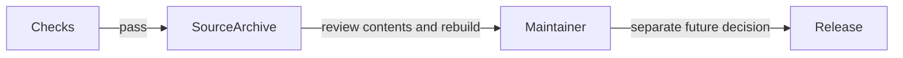

# Prepare a release

## Review a package before publication

As a maintainer, you need a checked source distribution and a deliberate version choice before publishing a package used by others.

Run `nix develop -c just sdist` to create a local archive. The prepared candidate is version 0.1.0.2. Run `cabal check` and rebuild the unpacked archive before publication. Generate the Hackage documentation bundle with `cabal haddock lib:tasty-bdd --haddock-for-hackage -O0`. The source archive and Haddock bundle are review artifacts; preparing them does not publish a package.

Repository ownership does not change Hackage ownership or existing package descriptions. Hackage 0.1.0.1 currently points to GitLab. A GitHub transfer alone will not update those links. Existing Hackage tarballs remain historical artifacts.

The release workflow prepares an archive for review and never uploads to Hackage. No automatic tagging or package publication is enabled by this modernization.
