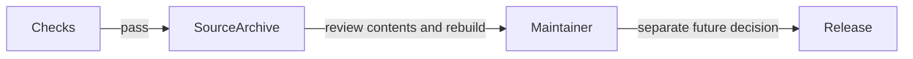

# Prepare a release

## Review a package before publication

As a maintainer, you need a checked source distribution and a deliberate version choice before publishing a package used by others.

Run `nix develop -c just sdist` to create a local archive. The current source still uses the already-published version 0.1.0.1; this archive is a review artifact and must not be uploaded under that version. Choose a new version and validate package metadata in a separate release change.

Repository ownership does not change Hackage ownership or existing package descriptions. Hackage 0.1.0.1 currently points to GitLab. A GitHub transfer alone will not update those links. Existing Hackage tarballs remain historical artifacts.

The release workflow prepares an archive for review and never uploads to Hackage. No automatic tagging or package publication is enabled by this modernization.
