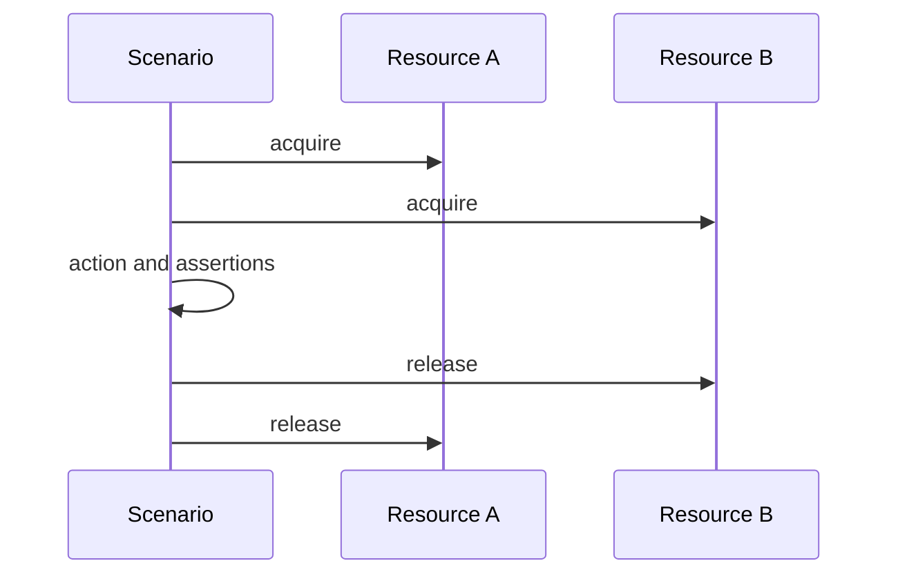

# Write a scenario

## Check an action's result

As a test author, you want a scenario to state its preparation and expected outcome clearly. The free-monad interface supports `do` notation:

```haskell
import Test.BDD.LanguageFree (given, then_, when_)
import Test.Tasty (defaultMain)
import Test.Tasty.Bdd ((@?=), testBehaviorF)

main :: IO ()
main = defaultMain $ testBehaviorF id "addition" $ do
    initial <- given $ pure (40 :: Int)
    when_ (pure $ initial + 2) $ then_ (@?= 42)
```

Change the expectation to 43 and the scenario fails with an equality diagnostic. `(@?/=)` checks inequality. `then__` runs an assertion that does not need the `when_` result.

## Set up and tear down resources

`givenAndAfter` returns both a value for later steps and a resource for teardown. `givenAndAfter_` acquires a resource only for teardown. Teardowns run in reverse acquisition order.



The free provider runs recorded teardown on success and caught failure. The constructor provider's fail-fast mode intentionally skips teardown after its equality failure. These existing behaviors differ; choose deliberately. Neither API promises exception-safe resource management for every possible asynchronous exception.
