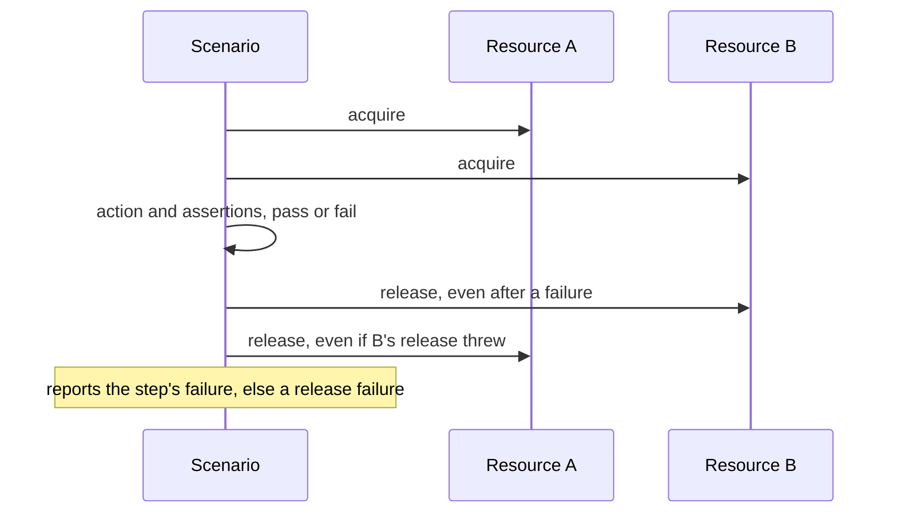

# Write a scenario

## Check an action's result

As a test author, you want a scenario to state its preparation and expected outcome clearly. The free-monad interface supports `do` notation:

```haskell
import Test.BDD.LanguageFree (given, then_, when_)
import Test.Tasty (defaultMain)
import Test.Tasty.Bdd ((@?=), testBehaviorF)

main :: IO ()
main = defaultMain $ testBehaviorF id "addition" $ do
    initial <- given $ pure (40 :: Int)
    when_ (pure $ initial + 2) $ then_ (@?= 42)
```

Change the expectation to 43 and the scenario fails with an equality diagnostic. `(@?/=)` checks inequality. `then__` runs an assertion that does not need the `when_` result.

## Set up and tear down resources

As a test author whose scenario holds real resources — a server, a temporary directory, a database connection — you want every one of them released however the scenario ends. `givenAndAfter` returns both a value for later steps and a resource for teardown. `givenAndAfter_` acquires a resource only for teardown. With the constructor language, `GivenAndAfter` does the same. Teardowns run in reverse acquisition order.


```mermaid
sequenceDiagram
  participant S as Scenario
  participant A as Resource A
  participant B as Resource B
  S->>A: acquire
  S->>B: acquire
  S->>S: action and assertions, pass or fail
  S->>B: release, even after a failure
  S->>A: release, even if B's release threw
  Note over S: reports the step's failure, else a release failure
```

Both providers release every acquired resource whether the scenario passes, fails an equality assertion, or fails because its action or an assertion throws. When an acquisition throws, the resources acquired before it are released and the scenario fails with the acquisition's exception. A release that throws does not stop the remaining releases. A failed scenario keeps its own failure as the reported reason, even when a release also throws; a scenario whose steps pass but whose release throws is reported failed.

With fail-fast on, the constructor provider skips teardown after a failed scenario, so its resources stay in place for inspection; a passing scenario still releases them. The free provider ignores the fail-fast option. Releases are not masked: neither API promises exception-safe resource management for every possible asynchronous exception.
