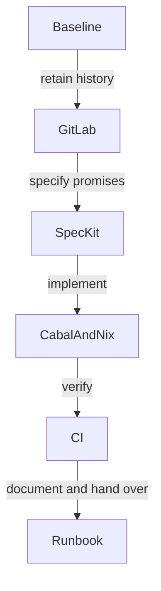

# Modernization implementation plan

## Status

Completed: original GitHub builds on GHC 9.12.3 and all six tests pass; GitLab comparison found nine descendant commits and source parity with published 0.1.0.1; branch fast-forwarded to GitLab history.
Current: the modernization branch is pushed for PR review and live CI. Cabal/Nix, documentation and Spec Kit setup are implemented; eight tests and the example pass, including from the rebuilt source archive. Two compiled mutations confirm dependency traversal and failed-prerequisite coverage.
External setup: the operator initialized the wiki and its Home, sidebar and September logbook are published. The organization Default runner group includes this public repository and has ten online nixos runners; CI selects nixos after transfer. The operator subsequently authorized the transfer; it completed with repository ID 110524936 preserved. Package publication remains outside execution scope.

## Contributor story

A contributor gets one reproducible build and a visible, executable review gate. A maintainer gets a safe, separately executable transfer handoff.

## Decisions

| Choice | Alternative | Reason |
|---|---|---|
| Fast-forward the work branch through GitLab | Reimplement its patch | Preserve attribution and already-published behavior. |
| Handwritten Cabal 3.0, version remains 0.1.0.1 | Keep Stack/hpack or bump version now | One package description; no release requested. |
| haskell.nix with GHC 9.12.3, pinned dependencies | Permissive bounds alone | Compilation and test evidence must be reproducible. |
| Executed sandbox checks and matching apps | Script derivations masquerading as checks | Green means the check ran. |
| Preserve master | Rename during ownership transfer | Avoid unrelated branch/link churn. |
| Prepared release configuration and artifacts | Automatic publication | A live Hackage package needs a separate version/release decision. |

## Forecast and resource limits

The original dependency build took approximately five minutes and about 0.3 GiB of new Cabal packages. No compiler port is indicated. Forecast: 15–30 minutes for history and specification; 45–90 minutes for Cabal/Nix and strict verification; 30–60 minutes for CI/docs/repository conventions; 15–30 minutes for final checks and handoff. Total 1.75–3.5 hours, subject to cache and runner availability. Inspect Nix realization size before downloads; use `/code` for sizeable scratch work and notify before approximately 10 GiB growth.

## Verification

Run the original and GitLab baselines, then `nix flake check --no-eval-cache`, `nix develop --quiet -c just ci`, and each surfaced app. Confirm a malformed source/formatting input makes the corresponding sandbox check fail. Compile and run the documented example. Inspect source distribution contents and build the unpacked archive. Verify branch/PR identity and live CI separately from local results. Transfer checks are operator-run steps, never claimed executed.
