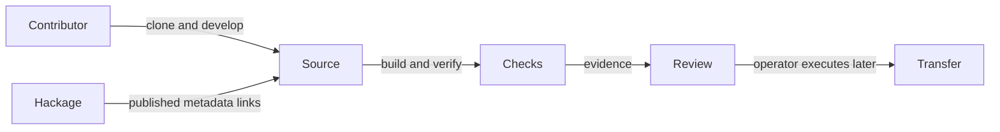

# Modernize development and prepare the repository move

## User stories

As a contributor, I can clone the project, enter its reproducible development environment, build the library and run its examples and tests with GHC 9.12.3. An invalid change causes a failing check rather than a misleading green workflow.

As an existing user, I retain the published BDD API and behavior, including recursive decorators over dependent Tasty tests. Modernization does not introduce a provider change or a new release.

As a maintainer, I have readable documentation, a Spec Kit constitution and task record, a draft pull request, CI and review rules, and a concrete transfer runbook that accounts for live Hackage metadata.

## Acceptance

- Record an actual untouched GitHub GHC 9.12 build verdict before planning. Preserve its command, output and source identity.
- Reconcile GitLab history and published 0.1.0.1 sources before source modernization; retain attribution and existing API.
- Cabal 3.x replaces Stack/hpack; a locked Nix flake builds and runs every test with GHC 9.12.3.
- Flake checks execute tests, formatting, lint, package checks and strict documentation builds. CI has a Build Gate, named downstream checks and a development-shell build.
- Spec Kit is initialized with a filled constitution and consistent spec, plan and tasks. README, user stories, architecture and development docs contain usable examples and diagrams.
- Configure applicable new-repository conventions on the existing GitHub repository; record any settings requiring operator interaction or the future organization transfer.
- Provide release preparation without uploading to Hackage or cutting a release. Published 0.1.0.1 and GitHub 0.1.0.0 cannot be treated as interchangeable package artifacts.
- Prepare the ownership-transfer procedure, verification and recovery steps in the lane handoffs. Do not execute the transfer.

## Constraints

Use the existing repository and preserve `master`. Do not create a destination repository that would block transfer. No comments or personal messages. Track disk growth and notify the operator before exceeding approximately 10 GiB. No `nixos-rebuild`.
