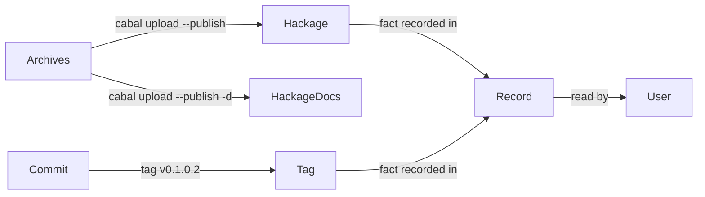

# Record the published 0.1.0.2 release

## User story

As a tasty-bdd user reading the repository or its documentation site, I check which version is released and observe 0.1.0.2 described as published on Hackage and tagged `v0.1.0.2`.

## Facts to record

- 0.1.0.2 was uploaded to Hackage on 2026-10-01 with documentation: https://hackage.haskell.org/package/tasty-bdd-0.1.0.2
- The source archive was uploaded with `cabal upload --publish` and the documentation archive with `cabal upload --publish -d`; both archives came from `nix build .#hackage-release`.
- The uploaded tarball's sha256 `2c8170f6f7e3279a968745ece3e988a3f8f38718db9ddf0f34844dd4cec5dbf3` equals the locally built `SHA256SUMS` entry.
- The annotated tag `v0.1.0.2` points at commit 0836274. No GitHub Release object exists; only the tag does.

## Requirements

- FR-001: the changelog's 0.1.0.2 heading no longer says "release candidate", and the sentence saying the candidate was not uploaded or tagged is replaced by the publication fact (Hackage, 2026-10-01, tag `v0.1.0.2`).
- FR-002: the README release paragraph states that Hackage carries 0.1.0.2 and no longer says the modernization has not published a package.
- FR-003: the release page no longer calls 0.1.0.2 a prepared candidate and records how it was published (manual `cabal upload --publish` of the `.#hackage-release` source and documentation archives).
- FR-004: no other file describes 0.1.0.2 as unpublished or as the current candidate. Completed ticket records under `specs/001-modernization` keep their history; a stale current-state sentence there receives an appended follow-up, never a rewrite.
- FR-005: the documentation build and every CI check pass.

## Non-goals

Release automation, library/test/API/CI changes, and rewriting earlier changelog entries.
