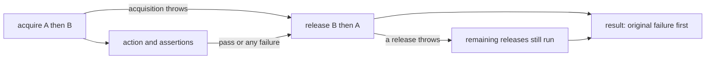

# Release every acquired resource however a scenario fails

## User story

As a tasty-bdd user whose scenarios acquire real resources with `GivenAndAfter` or `givenAndAfter`, I run a scenario that fails by any exception, or whose teardown throws, and observe every acquired resource released in reverse acquisition order, with the scenario reported as failed.

## Cases

Observed on master 0836274 with a resource log (`GivenAndAfter (pure "r1") release`, default ingredients, fail-fast off). Names are used by the tests and the plan.

| case | runner | scenario | released today | required |
|---|---|---|---|---|
| pass | constructor | every step passes | `r1` | unchanged |
| equality-failure | constructor | `Then` fails through `@?=` | `r1` | unchanged |
| when-throws | constructor | `When` throws `userError` | nothing | all, reverse order |
| then-throws | constructor | `Then` throws a non-`@?=` exception (HUnit `assertFailure`) | nothing | all, reverse order |
| acquisition-throws | constructor | second `GivenAndAfter` acquisition throws after the first succeeded | nothing | the first |
| teardown-throws | constructor | inner teardown throws, outer still held | nothing | the outer |
| free-when-throws | free | `when_` throws | `r1` | unchanged |
| free-teardown-throws | free | inner teardown throws, outer still held | nothing | the outer |

## Requirements

- FR-001: with fail-fast off, a constructor scenario whose `When` or `Then` throws any exception releases every acquired resource in reverse acquisition order and is reported failed.
- FR-002: a constructor scenario whose acquisition throws releases every resource acquired before it, in reverse order, and is reported failed; the resource that failed to acquire has no teardown.
- FR-003: in both runners, a teardown that throws does not prevent the remaining teardowns from running.
- FR-004: in both runners, a failed scenario reports its original failure; an exception thrown by a teardown never replaces or hides it.
- FR-005: in both runners, a scenario whose steps all pass but whose teardown throws is reported failed.
- FR-006: the pass, equality-failure and free-when-throws behaviour is preserved: release happens, in reverse acquisition order.
- FR-007: with fail-fast on, a failed constructor scenario still skips teardown, as documented. Behaviour changes only with fail-fast off. A passing scenario releases as before.
- FR-008: the public API is unchanged; the `api-compat` check passes against its unchanged baseline.
- FR-009: the scenarios page describes the new guarantee; the changelog gains an entry under an unreleased heading.
- FR-010: every CI check passes.

Each case in the table and each of FR-004, FR-005 and FR-007 has a test in the package's `test` suite asserting the released-resource log (and, where named, the reported result). The tests for when-throws, then-throws, acquisition-throws, teardown-throws and free-teardown-throws fail on master and pass after the fix.

## Non-goals

Changing fail-fast semantics; guarantees for asynchronous exceptions beyond masking the release steps; the `when` lens name clash; a version bump or Hackage upload.
