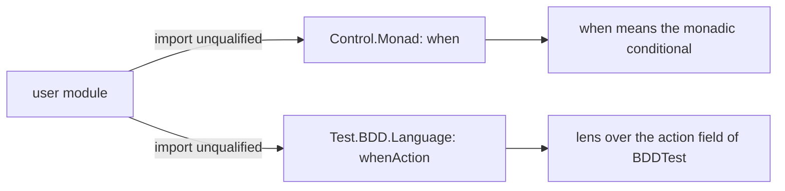

# Rename the `when` lens so it no longer clashes with `Control.Monad.when`

## User story

As a tasty-bdd user, I import `Test.BDD.Language` and `Control.Monad` unqualified and use `when`, and observe the module compiles, with `when` meaning the monadic conditional from `Control.Monad`.

## Current state

Observed on master fda8922:

- `Test.BDD.Language` exports a lens named `when` over the `_when` field of `BDDTest`; `interpret` in the same module uses it. No other module exports or re-exports it, and no test, example or documentation page uses it.
- A module importing both `Test.BDD.Language` and `Control.Monad` unqualified and using `when` fails to compile with an ambiguous occurrence of `when`.
- The `api-compat` check (`tools/check-api.sh`, run by `nix run .#api-compat`) requires the browsed exports of the four library modules to equal those of the hash-pinned Hackage 0.1.0.1 source, byte for byte.
- The package version is 0.1.0.2. `CHANGELOG.md` has an `## Unreleased` section holding the teardown-safety entries.

## Requirements

- FR-001: `Test.BDD.Language` exports `whenAction`, a lens over the action field of `BDDTest` with exactly the type the `when` lens had. No library module exports `when`.
- FR-002: the `whenAction` lens has a Haddock comment; Haddock coverage stays 100% for every library module.
- FR-003: every in-repository use of the old lens uses `whenAction`. No other export is renamed, removed, added or retyped; the record field `_when` keeps its name.
- FR-004: a module compiled by CI (in the `test` or `example` suite) imports `Test.BDD.Language` and `Control.Monad` unqualified and uses `when` as the monadic conditional. On the unchanged library it fails to compile because `when` is ambiguous; after the change it compiles.
- FR-005: the `api-compat` check accepts exactly one difference from the 0.1.0.1 baseline: the `when` export of `Test.BDD.Language` appears as `whenAction` with the same type. It fails when that baseline line is not found, and fails on any other difference, including `when` still being exported next to `whenAction` and any added, removed or retyped export. Its success message and the description of the check in `docs/development.md` state the accepted rename.
- FR-006: the package version is 0.2.0.0.
- FR-007: `CHANGELOG.md` has a `0.2.0.0` section marked as not yet on Hackage, holding the teardown-safety entries formerly under `Unreleased` and a migration note: the lens `when` is now `whenAction`, with the one-line change a user makes.
- FR-008: every CI check passes.

## Non-goals

Renaming any other export or the `_when` field; a deprecation cycle for `when`; teardown behaviour; publishing 0.2.0.0, tagging or uploading.
